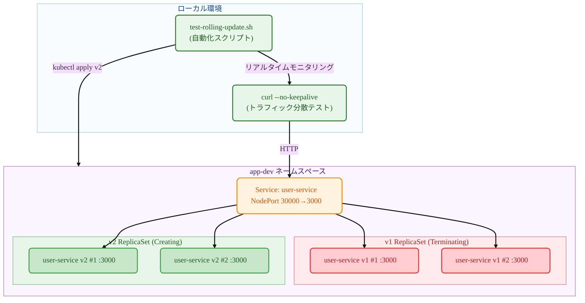

# Kubernetes Deployment

## 要約 (TL;DR)

このガイドは**Kubernetesローリングアップデート**を実際に体験するための実習書です！

- **内容**: kubectlコマンドで2つの異なるサービス（user-service、payment-service）を使用してローリングアップデートを実行し、トラフィック分散プロセスを観察します
- **目的**: Deploymentのローリングアップデートメカニズムと無停止デプロイプロセスを直接目で確認するためです
- **結果**: v1（user-service）→ v2（payment-service）へのローリングアップデートで、`--no-keepalive`オプションを使用して両サービスが同時にトラフィックを受ける区間の観察が完了しました

> 💡 **おすすめの対象**: Podは使ったことがあるがDeploymentローリングアップデートが気になる方、トラフィック分散プロセスを実際に見たい方

- **主な特徴**: 手動コマンドで各段階を直接実行しながら、別のターミナルでリアルタイムモニタリング

## 1. 構築するもの

- **ターゲットアーキテクチャ**:



- **作成するコンポーネント**
  - **Deployment** `user-service`: ローリングアップデートを管理するコントローラー
  - **v1 ReplicaSet**: user-service:1.0.0イメージを実行するPod群
  - **v2 ReplicaSet**: payment-service:1.0.0イメージを実行するPod群
  - **NodePort Service**: 外部からアクセス可能なサービス（ポート30000）
  - **自動化スクリプト**: 全プロセスを自動実行・監視

- **成功判定基準**
  - v1デプロイ完了後、すべてのリクエストが`user-service v1.0.0`で応答
  - ローリングアップデート中、Pod状態がTerminating/ContainerCreating/Runningで変化
  - アップデート完了後、すべてのリクエストが`payment-service v1.0.0`で応答
  - 単一のReplicaSetのみアクティブになり、ローリングアップデート完了確認
  - すべてのリソースが正常にクリーンアップ

## 2. 必要な準備

- OS: Linux / macOS / Windows 11 + WSL2(Ubuntu 22.04+)
- kubectl: v1.27+（Deploymentおよびrolloutサポート）
- コンテナランタイム: Docker（推奨）またはcontainerd（+nerdctl）
- ローカルクラスタ（以下から選択）
  - Minikube v1.33+（Dockerドライバー推奨）
  - またはkind / k3d、または既にアクセス可能なK8sクラスタ
- レジストリアクセス: Docker Hubから事前ビルドされたイメージをpull可能
  - `mogumogusityau/user-service:1.0.0`
  - `mogumogusityau/payment-service:1.0.0`
- ネットワーク/ポート: アウトバウンドHTTPS可能、NodePort 30000使用可能
- 検証ツール: curl（レスポンス確認用）

```bash
# 必要なイメージがpull可能か確認
$ docker pull mogumogusityau/user-service:1.0.0
$ docker pull mogumogusityau/payment-service:1.0.0
```

### Minikubeクラスタセットアップ

```bash
# クラスタ開始（ノード3個、CPU2個、メモリ8GB、Cilium CNI）
$ minikube start --driver=docker --nodes=3 --cpus=2 --memory=8g --cni=cilium
😄  minikube v1.36.0 on Ubuntu 24.04
✨  Using the docker driver based on user configuration
📌  Using Docker driver with root privileges
👍  Starting "minikube" primary control-plane node in "minikube" cluster
🚜  Pulling base image v0.0.47 ...
🔥  Creating docker container (CPUs=2, Memory=8192MB) ...
🐳  Preparing Kubernetes v1.33.1 on Docker 28.1.1 ...
    ▪ Generating certificates and keys ...
    ▪ Booting up control plane ...
    ▪ Configuring RBAC rules ...
🔗  Configuring Cilium (Container Networking Interface) ...
🔎  Verifying Kubernetes components...
    ▪ Using image gcr.io/k8s-minikube/storage-provisioner:v5
🌟  Enabled addons: default-storageclass, storage-provisioner
🏄  Done! kubectl is now configured to use "minikube" cluster and "default" namespace by default

# ノード状態確認
$ kubectl get nodes -o wide
NAME           STATUS   ROLES           AGE   VERSION   INTERNAL-IP    EXTERNAL-IP   OS-IMAGE             KERNEL-VERSION     CONTAINER-RUNTIME
minikube       Ready    control-plane   68s   v1.33.1   192.168.49.2   <none>        Ubuntu 22.04.5 LTS   6.8.0-79-generic   docker://28.1.1
minikube-m02   Ready    <none>          52s   v1.33.1   192.168.49.3   <none>        Ubuntu 22.04.5 LTS   6.8.0-79-generic   docker://28.1.1
minikube-m03   Ready    <none>          40s   v1.33.1   192.168.49.4   <none>        Ubuntu 22.04.5 LTS   6.8.0-79-generic   docker://28.1.1
```

## 3. 実行方法

- **ターミナル1: リアルタイムモニタリング**

```bash
# 実行権限付与（初回のみ）
$ chmod +x test-rolling-update.sh

# ローリングアップデート リアルタイムモニタリング（Ctrl+Cで終了）
$ ./test-rolling-update.sh
```

- **ターミナル2: デプロイコマンド手動実行**

```bash
# 1. ネームスペース作成
$ kubectl create namespace app-dev
namespace/app-dev created

# 2. v1デプロイ（user-service）
$ kubectl -n app-dev apply -f k8s/base/configmap.yaml
configmap/user-service-config created

$ kubectl -n app-dev apply -f k8s/base/deployment-v1.yaml
deployment.apps/user-service created

$ kubectl -n app-dev apply -f k8s/base/service-nodeport.yaml
service/user-service created

# 3. デプロイ完了待機（Ready状態確認）
$ kubectl -n app-dev get pods
NAME                            READY   STATUS    RESTARTS   AGE
user-service-7dbcddc6fc-29vqp   1/1     Running   0          7m37s
user-service-7dbcddc6fc-g6ndf   1/1     Running   0          7m37s
user-service-7dbcddc6fc-jzx49   1/1     Running   0          7m37s

# 4. v1サービステスト
$ curl --no-keepalive -s http://$(minikube ip):30000/ | jq

# 5. ローリングアップデート開始！（ここでターミナル2モニタリング開始）
$ kubectl -n app-dev apply -f k8s/base/deployment-v2.yaml
deployment.apps/user-service configured

# 6. ロールアウト状態確認
$ kubectl -n app-dev rollout status deployment/user-service
Waiting for deployment "user-service" rollout to finish: 2 out of 3 new replicas have been updated...
Waiting for deployment "user-service" rollout to finish: 1 old replicas are pending termination...
deployment "user-service" successfully rolled out

# 7. クリーンアップ
$ kubectl delete namespace app-dev
```

- **モニタリングスクリプトの機能**:
  - Pod状態リアルタイム出力（Running/Terminating/ContainerCreating）
  - サービス応答テスト（v1/v2トラフィック分散確認）
  - 混在区間でのトラフィック分布表示
  - Ctrl+Cでいつでも中断可能

## 4. コア概念まとめ

- **重要なポイント**:
  - **Rolling Update**: 既存のPodを段階的に新バージョンに交換する無停止デプロイ方式
  - **ReplicaSet**: 同一Pod複製を管理するコントローラー（Deploymentが自動生成）
  - **Traffic Distribution**: アップデート中に旧バージョンと新バージョンが同時にトラフィックを受ける区間
  - **NodePort**: クラスタ外部からアクセス可能なサービスタイプ
  - **Rollout Strategy**: maxUnavailable=1、maxSurge=1での安全なローリングアップデート設定

| コマンド | 説明 | 注意事項 |
|---------|------|----------|
| `kubectl rollout status` | ロールアウト進行状況リアルタイムモニタリング | 完了まで待機するブロッキングコマンド |
| `kubectl rollout history` | 過去のデプロイ履歴確認 | リビジョン番号でロールバック地点選択可能 |
| `kubectl rollout undo` | 前バージョンにロールバック | --to-revisionで特定バージョン指定可能 |
| `--no-keepalive` | HTTP接続を毎回新規作成 | ロードバランシング分散パターンを正確に観察可能 |

## 5. マニフェスト構造

### 5.1 Deploymentファイル

```yaml
# k8s/base/deployment-v1.yaml
# 目的: user-service:1.0.0を使用した初期デプロイ
apiVersion: apps/v1
kind: Deployment
metadata:
  name: user-service
  labels:
    app.kubernetes.io/name: user-service
    app.kubernetes.io/version: "1.0.0"
spec:
  replicas: 3
  strategy:
    type: RollingUpdate
    rollingUpdate:
      maxUnavailable: 1
      maxSurge: 1
  selector:
    matchLabels:
      app.kubernetes.io/name: user-service
  template:
    metadata:
      labels:
        app.kubernetes.io/name: user-service
        app.kubernetes.io/version: "1.0.0"
    spec:
      containers:
        - name: app
          image: mogumogusityau/user-service:1.0.0
          imagePullPolicy: IfNotPresent
          ports:
            - containerPort: 3000
          env:
            - name: PORT
              valueFrom:
                configMapKeyRef:
                  name: user-service-config
                  key: PORT
            - name: VERSION
              value: "1.0.0"
```

```yaml
# k8s/base/deployment-v2.yaml  
# 目的: payment-service:1.0.0へのローリングアップデート
apiVersion: apps/v1
kind: Deployment
metadata:
  name: user-service  # 同じ名前でアップデート
  labels:
    app.kubernetes.io/name: user-service
    app.kubernetes.io/version: "2.0.0"
spec:
  replicas: 3
  strategy:
    type: RollingUpdate
    rollingUpdate:
      maxUnavailable: 1
      maxSurge: 1
  selector:
    matchLabels:
      app.kubernetes.io/name: user-service
  template:
    metadata:
      labels:
        app.kubernetes.io/name: user-service
        app.kubernetes.io/version: "2.0.0"
    spec:
      containers:
        - name: app
          image: mogumogusityau/payment-service:1.0.0  # 別サービスに変更
          imagePullPolicy: IfNotPresent
          ports:
            - containerPort: 3000
          env:
            - name: PORT
              valueFrom:
                configMapKeyRef:
                  name: user-service-config
                  key: PORT
            - name: VERSION
              value: "2.0.0"
            - name: MESSAGE
              value: "Hello from Payment Service!"
```

```yaml
# k8s/base/service-nodeport.yaml
# 目的: 外部アクセス用NodePortサービス
apiVersion: v1
kind: Service
metadata:
  name: user-service
  namespace: app-dev
  labels:
    app.kubernetes.io/name: user-service
spec:
  type: NodePort
  ports:
    - port: 3000
      targetPort: 3000
      nodePort: 30000
      protocol: TCP
      name: http
  selector:
    app.kubernetes.io/name: user-service
```

### 5.2 詳細検証

- **ローリングアップデートプロセスの観察**:

```bash
# 1. 初期状態（v1完全デプロイ）
--- Pod Status ---
user-service-7dbcddc6fc-5z5wp 1/1 Running
user-service-7dbcddc6fc-fmwgq 1/1 Running  
user-service-7dbcddc6fc-kbk57 1/1 Running

--- Service Responses ---
Request 1: user-service v1.0.0
Request 2: user-service v1.0.0
Request 3: user-service v1.0.0

# 2. ローリングアップデート進行中（混在区間）
--- Pod Status ---
user-service-5ffc8dbcf6-7jtrm 1/1 Running      # 新ReplicaSet（v2）
user-service-5ffc8dbcf6-zd44d 1/1 Running      # 新ReplicaSet（v2）
user-service-7dbcddc6fc-5z5wp 1/1 Terminating  # 既存ReplicaSet（v1）
user-service-7dbcddc6fc-fmwgq 1/1 Running      # 既存ReplicaSet（v1）

--- Service Responses ---
Request 19: payment-service v1.0.0
Request 20: Connection failed  # Pod準備中
Request 21: Connection failed

# 3. ローリングアップデート完了（v2完全デプロイ）
--- Pod Status ---
user-service-5ffc8dbcf6-7jtrm 1/1 Running
user-service-5ffc8dbcf6-pl2vs 1/1 Running
user-service-5ffc8dbcf6-zd44d 1/1 Running

--- Service Responses ---
Request 46: payment-service v1.0.0
Request 47: payment-service v1.0.0
Request 48: payment-service v1.0.0
```

- **最終状態確認**:

```bash
$ kubectl -n app-dev get all
NAME                                READY   STATUS    RESTARTS   AGE
pod/user-service-5ffc8dbcf6-7jtrm   1/1     Running   0          47s
pod/user-service-5ffc8dbcf6-pl2vs   1/1     Running   0          34s
pod/user-service-5ffc8dbcf6-zd44d   1/1     Running   0          47s

NAME                           READY   UP-TO-DATE   AVAILABLE   AGE
deployment.apps/user-service   3/3     3            3           61s

NAME                                      DESIRED   CURRENT   READY   AGE
replicaset.apps/user-service-5ffc8dbcf6   3         3         3       47s  # アクティブ
replicaset.apps/user-service-7dbcddc6fc   0         0         0       61s  # 非アクティブ
```

### 5.3 手動検証方法

```bash
# ReplicaSet変化観察
$ kubectl -n app-dev get rs -w
NAME                      DESIRED   CURRENT   READY   AGE
user-service-7dbcddc6fc   3         3         3       2m
user-service-5ffc8dbcf6   0         0         0       0s
user-service-5ffc8dbcf6   0         0         0       0s
user-service-5ffc8dbcf6   1         0         0       0s
user-service-5ffc8dbcf6   1         0         0       0s
user-service-5ffc8dbcf6   1         1         0       0s
user-service-7dbcddc6fc   2         3         3       2m
user-service-5ffc8dbcf6   1         1         1       12s
user-service-5ffc8dbcf6   2         1         1       12s
...

# ロールアウト履歴確認
$ kubectl -n app-dev rollout history deployment/user-service
deployment.apps/user-service 
REVISION  CHANGE-CAUSE
1         <none>
2         <none>

# 特定Podログリアルタイム確認
$ kubectl -n app-dev logs -f deployment/user-service
🚀 Payment service is running on http://0.0.0.0:3000
```

## 6. ロールバック・クリーンアップ

```bash
# 前バージョンへのロールバック（必要時）
$ kubectl -n app-dev rollout undo deployment/user-service
deployment.apps/user-service rolled back

# ロールバック進行状況モニタリング
$ kubectl -n app-dev rollout status deployment/user-service --timeout=300s

# 完全なクリーンアップ（自動化スクリプトに含まれる）
$ kubectl delete namespace app-dev
namespace "app-dev" deleted

# すべてのリソースが削除されているか確認
$ kubectl get all -n app-dev
No resources found in app-dev namespace.
```

## 7. まとめ

このガイドを通して、**Kubernetes Deploymentのローリングアップデート全体プロセス**を完全に体験しました：

* **無停止デプロイ**: サービス中断なくv1 → v2への段階的アップデート
* **トラフィック分散**: アップデート中に旧バージョンと新バージョンが同時にリクエストを処理する区間を観察
* **自動化**: 全プロセスをスクリプトで自動化し、再現可能なテスト環境構築
* **リアルタイムモニタリング**: Pod状態変化とReplicaSet切り替えプロセスをリアルタイムで追跡

**主要学習ポイント**:
- RollingUpdate戦略のmaxUnavailable/maxSurge設定の効果
- ReplicaSetによるPodバージョン管理メカニズム
- NodePortによる外部トラフィックアクセスと負荷分散
- `--no-keepalive`オプションによる正確なロードバランシングパターン観察

この資料は実際のプロダクション環境での無停止デプロイ戦略構築に活用できます。次回はより高度なデプロイ戦略を扱う予定です。