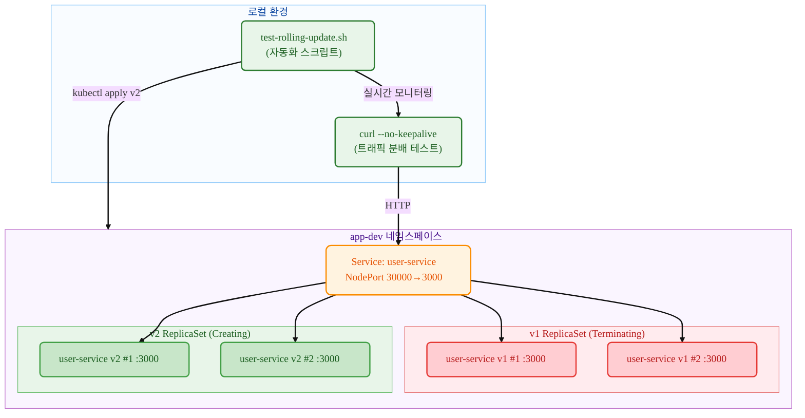

# Kubernetes Deployment

## 요약 (TL;DR)

이 가이드는 **Kubernetes 롤링 업데이트**를 실제로 체험해보는 실습서입니다!

- **무엇을**: kubectl 명령어로 서로 다른 두 서비스(user-service, payment-service)를 이용해 롤링 업데이트를 실행하고 트래픽 분배 과정을 관찰하기
- **왜**: Deployment의 롤링 업데이트 메커니즘과 무중단 배포 과정을 눈으로 직접 확인하기 위해
- **결과**: v1(user-service) → v2(payment-service)로 롤링 업데이트되면서 두 서비스가 동시에 트래픽을 받는 구간을 `--no-keepalive` 옵션으로 관찰 완료

> 💡 **이런 분들께 추천**: Pod는 써봤는데 Deployment 롤링 업데이트가 궁금한 분, 트래픽 분배 과정을 실제로 보고 싶은 분

- **핵심 특징**: 수동 명령어로 각 단계를 직접 실행하면서, 별도 터미널에서 실시간 모니터링

## 1. 우리가 만들 것 (What you'll build)

- **목표 아키텍처**:



- **만들게 될 것들**
  - **Deployment** `user-service`: 롤링 업데이트를 관리하는 컨트롤러
  - **v1 ReplicaSet**: user-service:1.0.0 이미지를 실행하는 Pod들
  - **v2 ReplicaSet**: payment-service:1.0.0 이미지를 실행하는 Pod들  
  - **NodePort Service**: 외부에서 접근 가능한 서비스 (포트 30000)
  - **자동화 스크립트**: 전체 과정을 자동으로 실행하고 모니터링

- **성공 판정 기준**
  - v1 배포 완료 후 모든 요청이 `user-service v1.0.0`으로 응답
  - 롤링 업데이트 중 Pod 상태가 Terminating/ContainerCreating/Running으로 변화
  - 업데이트 완료 후 모든 요청이 `payment-service v1.0.0`으로 응답
  - 단일 ReplicaSet만 활성화되어 롤링 업데이트 완료 확인
  - 모든 리소스 정리

## 2. 준비물 (Prereqs)

- OS: Linux / macOS / Windows 11 + WSL2(Ubuntu 22.04+)
- kubectl: v1.27+ (Deployment 및 rollout 지원)
- 컨테이너 런타임: Docker(권장) 또는 containerd(+nerdctl)
- 로컬 클러스터(택1)
  - Minikube v1.33+ (Docker driver 권장)
  - 또는 kind / k3d, 또는 이미 접근 가능한 K8s 클러스터
- 레지스트리 접근: Docker Hub에서 사전 빌드된 이미지 pull 가능
  - `mogumogusityau/user-service:1.0.0`
  - `mogumogusityau/payment-service:1.0.0`
- 네트워크/포트: 아웃바운드 HTTPS 가능, NodePort 30000 사용 가능
- 검증 도구: curl (응답 확인용)

```bash
# 필요한 이미지가 pull 가능한지 확인
$ docker pull mogumogusityau/user-service:1.0.0
$ docker pull mogumogusityau/payment-service:1.0.0
```

### Minikube 클러스터 설정

```bash
# 클러스터 시작 (노드 3개, CPU 2개, 메모리 8GB, Cilium CNI)
$ minikube start --driver=docker --nodes=3 --cpus=2 --memory=8g --cni=cilium
😄  minikube v1.36.0 on Ubuntu 24.04
✨  Using the docker driver based on user configuration
📌  Using Docker driver with root privileges
👍  Starting "minikube" primary control-plane node in "minikube" cluster
🚜  Pulling base image v0.0.47 ...
🔥  Creating docker container (CPUs=2, Memory=8192MB) ...
🐳  Preparing Kubernetes v1.33.1 on Docker 28.1.1 ...
    ▪ Generating certificates and keys ...
    ▪ Booting up control plane ...
    ▪ Configuring RBAC rules ...
🔗  Configuring Cilium (Container Networking Interface) ...
🔎  Verifying Kubernetes components...
    ▪ Using image gcr.io/k8s-minikube/storage-provisioner:v5
🌟  Enabled addons: default-storageclass, storage-provisioner
🏄  Done! kubectl is now configured to use "minikube" cluster and "default" namespace by default

# 노드 상태 확인
$ kubectl get nodes -o wide
NAME           STATUS   ROLES           AGE   VERSION   INTERNAL-IP    EXTERNAL-IP   OS-IMAGE             KERNEL-VERSION     CONTAINER-RUNTIME
minikube       Ready    control-plane   68s   v1.33.1   192.168.49.2   <none>        Ubuntu 22.04.5 LTS   6.8.0-79-generic   docker://28.1.1
minikube-m02   Ready    <none>          52s   v1.33.1   192.168.49.3   <none>        Ubuntu 22.04.5 LTS   6.8.0-79-generic   docker://28.1.1
minikube-m03   Ready    <none>          40s   v1.33.1   192.168.49.4   <none>        Ubuntu 22.04.5 LTS   6.8.0-79-generic   docker://28.1.1
```

## 3. 실행 방법

- **터미널 1: 실시간 모니터링**

```bash
# 실행 권한 부여 (최초 1회)
$ chmod +x test-rolling-update.sh

# 롤링 업데이트 실시간 모니터링 (Ctrl+C로 종료)
$ ./test-rolling-update.sh
```

- **터미널 2: 배포 명령어 수동 실행**

```bash
# 1. 네임스페이스 생성
$ kubectl create namespace app-dev
namespace/app-dev created

# 2. v1 배포 (user-service)
$ kubectl -n app-dev apply -f k8s/base/configmap.yaml
configmap/user-service-config created

$ kubectl -n app-dev apply -f k8s/base/deployment-v1.yaml
deployment.apps/user-service created

$ kubectl -n app-dev apply -f k8s/base/service-nodeport.yaml
service/user-service created

# 3. 배포 완료 대기 (Ready 상태 확인)
$ kubectl -n app-dev get pods
NAME                            READY   STATUS    RESTARTS   AGE
user-service-7dbcddc6fc-29vqp   1/1     Running   0          7m37s
user-service-7dbcddc6fc-g6ndf   1/1     Running   0          7m37s
user-service-7dbcddc6fc-jzx49   1/1     Running   0          7m37s

# 4. v1 서비스 테스트
$ curl --no-keepalive -s http://$(minikube ip):30000/ | jq

# 5. 롤링 업데이트 시작! (여기서 터미널2 모니터링 시작)
$ kubectl -n app-dev apply -f k8s/base/deployment-v2.yaml
deployment.apps/user-service configured

# 6. 롤아웃 상태 확인
$ kubectl -n app-dev rollout status deployment/user-service
Waiting for deployment "user-service" rollout to finish: 2 out of 3 new replicas have been updated...
Waiting for deployment "user-service" rollout to finish: 1 old replicas are pending termination...
deployment "user-service" successfully rolled out

# 7. 정리
$ kubectl delete namespace app-dev
```

- **모니터링 스크립트 기능**:
  - Pod 상태 실시간 출력 (Running/Terminating/ContainerCreating)
  - 서비스 응답 테스트 (v1/v2 트래픽 분배 확인)
  - 혼재 구간에서 트래픽 분포 표시
  - Ctrl+C로 언제든 중단 가능

## 4. 핵심 개념 요약 (Concepts)

- **꼭 알아야 할 포인트**:
  - **Rolling Update**: 기존 Pod를 점진적으로 새 버전으로 교체하는 무중단 배포 방식
  - **ReplicaSet**: 동일한 Pod의 복제본을 관리하는 컨트롤러 (Deployment가 자동 생성)
  - **Traffic Distribution**: 업데이트 중 구버전과 신버전이 동시에 트래픽을 받는 구간
  - **NodePort**: 클러스터 외부에서 접근 가능한 서비스 타입
  - **Rollout Strategy**: maxUnavailable=1, maxSurge=1로 안전한 롤링 업데이트 설정

| 구분 | 설명 | 주의사항 |
|------|------|----------|
| `kubectl rollout status` | 롤아웃 진행상황 실시간 모니터링 | 완료될 때까지 대기하는 블로킹 명령어 |
| `kubectl rollout history` | 이전 배포 이력 확인 | revision 번호로 롤백 지점 선택 가능 |
| `kubectl rollout undo` | 이전 버전으로 롤백 | --to-revision으로 특정 버전 지정 가능 |
| `--no-keepalive` | HTTP 연결을 매번 새로 생성 | 로드밸런싱 분배 패턴을 정확히 관찰 가능 |

## 5. 매니페스트 구조

### 5.1 Deployment 파일

```yaml
# k8s/base/deployment-v1.yaml
# 목적: user-service:1.0.0을 사용한 초기 배포
apiVersion: apps/v1
kind: Deployment
metadata:
  name: user-service
  labels:
    app.kubernetes.io/name: user-service
    app.kubernetes.io/version: "1.0.0"
spec:
  replicas: 3
  strategy:
    type: RollingUpdate
    rollingUpdate:
      maxUnavailable: 1
      maxSurge: 1
  selector:
    matchLabels:
      app.kubernetes.io/name: user-service
  template:
    metadata:
      labels:
        app.kubernetes.io/name: user-service
        app.kubernetes.io/version: "1.0.0"
    spec:
      containers:
        - name: app
          image: mogumogusityau/user-service:1.0.0
          imagePullPolicy: IfNotPresent
          ports:
            - containerPort: 3000
          env:
            - name: PORT
              valueFrom:
                configMapKeyRef:
                  name: user-service-config
                  key: PORT
            - name: VERSION
              value: "1.0.0"
```

```yaml
# k8s/base/deployment-v2.yaml  
# 목적: payment-service:1.0.0으로 롤링 업데이트
apiVersion: apps/v1
kind: Deployment
metadata:
  name: user-service  # 동일한 이름으로 업데이트
  labels:
    app.kubernetes.io/name: user-service
    app.kubernetes.io/version: "2.0.0"
spec:
  replicas: 3
  strategy:
    type: RollingUpdate
    rollingUpdate:
      maxUnavailable: 1
      maxSurge: 1
  selector:
    matchLabels:
      app.kubernetes.io/name: user-service
  template:
    metadata:
      labels:
        app.kubernetes.io/name: user-service
        app.kubernetes.io/version: "2.0.0"
    spec:
      containers:
        - name: app
          image: mogumogusityau/payment-service:1.0.0  # 다른 서비스로 변경
          imagePullPolicy: IfNotPresent
          ports:
            - containerPort: 3000
          env:
            - name: PORT
              valueFrom:
                configMapKeyRef:
                  name: user-service-config
                  key: PORT
            - name: VERSION
              value: "2.0.0"
            - name: MESSAGE
              value: "Hello from Payment Service!"
```

```yaml
# k8s/base/service-nodeport.yaml
# 목적: 외부 접근을 위한 NodePort 서비스
apiVersion: v1
kind: Service
metadata:
  name: user-service
  namespace: app-dev
  labels:
    app.kubernetes.io/name: user-service
spec:
  type: NodePort
  ports:
    - port: 3000
      targetPort: 3000
      nodePort: 30000
      protocol: TCP
      name: http
  selector:
    app.kubernetes.io/name: user-service
```

### 5.2 상세 검증 (Verification)

- **롤링 업데이트 과정 관찰**:

```bash
# 1. 초기 상태 (v1 완전 배포)
--- Pod Status ---
user-service-7dbcddc6fc-5z5wp 1/1 Running
user-service-7dbcddc6fc-fmwgq 1/1 Running  
user-service-7dbcddc6fc-kbk57 1/1 Running

--- Service Responses ---
Request 1: user-service v1.0.0
Request 2: user-service v1.0.0
Request 3: user-service v1.0.0

# 2. 롤링 업데이트 진행 중 (혼재 구간)
--- Pod Status ---
user-service-5ffc8dbcf6-7jtrm 1/1 Running      # 새 ReplicaSet (v2)
user-service-5ffc8dbcf6-zd44d 1/1 Running      # 새 ReplicaSet (v2)
user-service-7dbcddc6fc-5z5wp 1/1 Terminating  # 기존 ReplicaSet (v1)
user-service-7dbcddc6fc-fmwgq 1/1 Running      # 기존 ReplicaSet (v1)

--- Service Responses ---
Request 19: payment-service v1.0.0
Request 20: Connection failed  # Pod 준비 중
Request 21: Connection failed

# 3. 롤링 업데이트 완료 (v2 완전 배포)
--- Pod Status ---
user-service-5ffc8dbcf6-7jtrm 1/1 Running
user-service-5ffc8dbcf6-pl2vs 1/1 Running
user-service-5ffc8dbcf6-zd44d 1/1 Running

--- Service Responses ---
Request 46: payment-service v1.0.0
Request 47: payment-service v1.0.0
Request 48: payment-service v1.0.0
```

- **최종 상태 확인**:

```bash
$ kubectl -n app-dev get all
NAME                                READY   STATUS    RESTARTS   AGE
pod/user-service-5ffc8dbcf6-7jtrm   1/1     Running   0          47s
pod/user-service-5ffc8dbcf6-pl2vs   1/1     Running   0          34s
pod/user-service-5ffc8dbcf6-zd44d   1/1     Running   0          47s

NAME                           READY   UP-TO-DATE   AVAILABLE   AGE
deployment.apps/user-service   3/3     3            3           61s

NAME                                      DESIRED   CURRENT   READY   AGE
replicaset.apps/user-service-5ffc8dbcf6   3         3         3       47s  # 활성
replicaset.apps/user-service-7dbcddc6fc   0         0         0       61s  # 비활성
```

### 5.3 수동 검증 방법

```bash
# ReplicaSet 변화 관찰
$ kubectl -n app-dev get rs -w
NAME                      DESIRED   CURRENT   READY   AGE
user-service-7dbcddc6fc   3         3         3       2m
user-service-5ffc8dbcf6   0         0         0       0s
user-service-5ffc8dbcf6   0         0         0       0s
user-service-5ffc8dbcf6   1         0         0       0s
user-service-5ffc8dbcf6   1         0         0       0s
user-service-5ffc8dbcf6   1         1         0       0s
user-service-7dbcddc6fc   2         3         3       2m
user-service-5ffc8dbcf6   1         1         1       12s
user-service-5ffc8dbcf6   2         1         1       12s
...

# 롤아웃 히스토리 확인
$ kubectl -n app-dev rollout history deployment/user-service
deployment.apps/user-service 
REVISION  CHANGE-CAUSE
1         <none>
2         <none>

# 특정 Pod 로그 실시간 확인
$ kubectl -n app-dev logs -f deployment/user-service
🚀 Payment service is running on http://0.0.0.0:3000
```

## 6. 롤백/청소 (Rollback & Cleanup)

```bash
# 이전 버전으로 롤백 (필요시)
$ kubectl -n app-dev rollout undo deployment/user-service
deployment.apps/user-service rolled back

# 롤백 진행상황 모니터링
$ kubectl -n app-dev rollout status deployment/user-service --timeout=300s

# 완전한 정리 (자동화 스크립트에 포함됨)
$ kubectl delete namespace app-dev
namespace "app-dev" deleted

# 모든 리소스가 삭제되었는지 확인
$ kubectl get all -n app-dev
No resources found in app-dev namespace.
```

## 7. 마무리 (Conclusion)

이 가이드를 통해 **Kubernetes Deployment의 롤링 업데이트 전체 과정**을 완전히 경험했습니다:

* **무중단 배포**: 서비스 중단 없이 v1 → v2로 점진적 업데이트
* **트래픽 분배**: 업데이트 중 구버전과 신버전이 동시에 요청을 처리하는 구간 관찰
* **자동화**: 전체 과정을 스크립트로 자동화하여 재현 가능한 테스트 환경 구축
* **실시간 모니터링**: Pod 상태 변화와 ReplicaSet 전환 과정을 실시간으로 추적

**핵심 학습 포인트**:
- RollingUpdate 전략의 maxUnavailable/maxSurge 설정 효과
- ReplicaSet을 통한 Pod 버전 관리 메커니즘  
- NodePort를 통한 외부 트래픽 접근과 부하 분산
- `--no-keepalive` 옵션을 통한 정확한 로드밸런싱 패턴 관찰

해당 자료는 실제 프로덕션 환경에서의 무중단 배포 전략 수립에 활용할 수 있습니다. 다음에는 더 고도화된 배포 전략들을 다룰 예정입니다.