# Kubernetes Deployment

## Summary (TL;DR)

This guide provides hands-on experience with **Kubernetes Rolling Updates**!

- **What**: Execute rolling updates using kubectl commands with two different services (user-service, payment-service) and observe the traffic distribution process
- **Why**: To directly witness the Deployment rolling update mechanism and zero-downtime deployment process
- **Result**: Successfully observe the rolling update from v1 (user-service) → v2 (payment-service), monitoring the traffic distribution period where both services handle requests simultaneously using the `--no-keepalive` option

> 💡 **Recommended for**: Those who have used Pods but are curious about Deployment rolling updates, and want to see the traffic distribution process in action

- **Key Feature**: Manual execution of each step with real-time monitoring from a separate terminal

## 1. What You'll Build

- **Target Architecture**:

```mermaid
%%{init: {
  'theme': 'base',
  'themeVariables': {
    'fontFamily': 'Inter, Pretendard, sans-serif'
  }
}}%%

flowchart TB

%% ---------- Class definitions ----------
classDef boxLocal    fill:#E3F2FD,stroke:#1E88E5,color:#0D47A1,stroke-width:2px,rx:6,ry:6;
classDef boxK8s      fill:#F3E5F5,stroke:#8E24AA,color:#4A148C,stroke-width:2px,rx:6,ry:6;
classDef boxSvc      fill:#FFF3E0,stroke:#FB8C00,color:#E65100,stroke-width:2px,rx:8,ry:8;
classDef boxV1       fill:#FFCDD2,stroke:#E53935,color:#B71C1C,stroke-width:2px,rx:6,ry:6;
classDef boxV2       fill:#C8E6C9,stroke:#43A047,color:#1B5E20,stroke-width:2px,rx:6,ry:6;
classDef boxTool     fill:#E8F5E9,stroke:#2E7D32,color:#1B5E20,stroke-width:2px,rx:6,ry:6;

%% Default link style (darker & thicker)
linkStyle default stroke:#111,stroke-width:2px;

%% ---------- Local ----------
subgraph Local["Local Environment"]
  direction TB
  script["test-rolling-update.sh<br/>(Automation Script)"]:::boxTool
  curl["curl --no-keepalive<br/>(Traffic Distribution Test)"]:::boxTool
end
style Local fill:#F9FCFF,stroke:#90CAF9,color:#0D47A1

%% ---------- K8s ----------
subgraph K8s["app-dev Namespace"]
  direction LR

  subgraph V1["v1 ReplicaSet (Terminating)"]
    direction TB
    p1["user-service v1 #1 :3000"]:::boxV1
    p2["user-service v1 #2 :3000"]:::boxV1
  end
  style V1 fill:#FFEBEE,stroke:#E57373,color:#B71C1C

  SVC["Service: user-service<br/>NodePort 30000→3000"]:::boxSvc

  subgraph V2["v2 ReplicaSet (Creating)"]
    direction TB
    p3["user-service v2 #1 :3000"]:::boxV2
    p4["user-service v2 #2 :3000"]:::boxV2
  end
  style V2 fill:#E8F5E9,stroke:#66BB6A,color:#1B5E20
end
style K8s fill:#FAF5FF,stroke:#BA68C8,color:#4A148C

%% ---------- Edges ----------
script -->|kubectl apply v2| K8s
script -->|Real-time monitoring| curl
curl -->|HTTP| SVC
SVC --> p1
SVC --> p2
SVC --> p3
SVC --> p4
%% Optional: emphasize traffic edges to new pods
%% linkStyle <index> stroke:#2E7D32,stroke-width:3px;
```



- **Components to be Created**
  - **Deployment** `user-service`: Controller managing rolling updates
  - **v1 ReplicaSet**: Pods running user-service:1.0.0 image
  - **v2 ReplicaSet**: Pods running payment-service:1.0.0 image
  - **NodePort Service**: Externally accessible service (port 30000)
  - **Automation Script**: Automatically executes and monitors the entire process

- **Success Criteria**
  - After v1 deployment completion, all requests respond with `user-service v1.0.0`
  - During rolling update, Pod states transition through Terminating/ContainerCreating/Running
  - After update completion, all requests respond with `payment-service v1.0.0`
  - Only a single ReplicaSet remains active, confirming rolling update completion
  - All resources are cleaned up

## 2. Prerequisites

- OS: Linux / macOS / Windows 11 + WSL2(Ubuntu 22.04+)
- kubectl: v1.27+ (supporting Deployment and rollout)
- Container Runtime: Docker (recommended) or containerd (+nerdctl)
- Local Cluster (choose one)
  - Minikube v1.33+ (Docker driver recommended)
  - or kind / k3d, or existing accessible K8s cluster
- Registry Access: Ability to pull pre-built images from Docker Hub
  - `mogumogusityau/user-service:1.0.0`
  - `mogumogusityau/payment-service:1.0.0`
- Network/Ports: Outbound HTTPS capability, NodePort 30000 availability
- Verification Tools: curl (for response verification)

```bash
# Verify required images can be pulled
$ docker pull mogumogusityau/user-service:1.0.0
$ docker pull mogumogusityau/payment-service:1.0.0
```

### Minikube Cluster Setup

```bash
# Start cluster (3 nodes, 2 CPUs, 8GB memory, Cilium CNI)
$ minikube start --driver=docker --nodes=3 --cpus=2 --memory=8g --cni=cilium
😄  minikube v1.36.0 on Ubuntu 24.04
✨  Using the docker driver based on user configuration
📌  Using Docker driver with root privileges
👍  Starting "minikube" primary control-plane node in "minikube" cluster
🚜  Pulling base image v0.0.47 ...
🔥  Creating docker container (CPUs=2, Memory=8192MB) ...
🐳  Preparing Kubernetes v1.33.1 on Docker 28.1.1 ...
    ▪ Generating certificates and keys ...
    ▪ Booting up control plane ...
    ▪ Configuring RBAC rules ...
🔗  Configuring Cilium (Container Networking Interface) ...
🔎  Verifying Kubernetes components...
    ▪ Using image gcr.io/k8s-minikube/storage-provisioner:v5
🌟  Enabled addons: default-storageclass, storage-provisioner
🏄  Done! kubectl is now configured to use "minikube" cluster and "default" namespace by default

# Check node status
$ kubectl get nodes -o wide
NAME           STATUS   ROLES           AGE   VERSION   INTERNAL-IP    EXTERNAL-IP   OS-IMAGE             KERNEL-VERSION     CONTAINER-RUNTIME
minikube       Ready    control-plane   68s   v1.33.1   192.168.49.2   <none>        Ubuntu 22.04.5 LTS   6.8.0-79-generic   docker://28.1.1
minikube-m02   Ready    <none>          52s   v1.33.1   192.168.49.3   <none>        Ubuntu 22.04.5 LTS   6.8.0-79-generic   docker://28.1.1
minikube-m03   Ready    <none>          40s   v1.33.1   192.168.49.4   <none>        Ubuntu 22.04.5 LTS   6.8.0-79-generic   docker://28.1.1
```

## 3. Execution Method

- **Terminal 1: Real-time Monitoring**

```bash
# Grant execution permission (first time only)
$ chmod +x test-rolling-update.sh

# Rolling update real-time monitoring (Ctrl+C to exit)
$ ./test-rolling-update.sh
```

- **Terminal 2: Manual Deployment Commands**

```bash
# 1. Create namespace
$ kubectl create namespace app-dev
namespace/app-dev created

# 2. Deploy v1 (user-service)
$ kubectl -n app-dev apply -f k8s/base/configmap.yaml
configmap/user-service-config created

$ kubectl -n app-dev apply -f k8s/base/deployment-v1.yaml
deployment.apps/user-service created

$ kubectl -n app-dev apply -f k8s/base/service-nodeport.yaml
service/user-service created

# 3. Wait for deployment completion (confirm Ready status)
$ kubectl -n app-dev get pods
NAME                            READY   STATUS    RESTARTS   AGE
user-service-7dbcddc6fc-29vqp   1/1     Running   0          7m37s
user-service-7dbcddc6fc-g6ndf   1/1     Running   0          7m37s
user-service-7dbcddc6fc-jzx49   1/1     Running   0          7m37s

# 4. Test v1 service
$ curl --no-keepalive -s http://$(minikube ip):30000/ | jq

# 5. Start rolling update! (Begin Terminal 2 monitoring here)
$ kubectl -n app-dev apply -f k8s/base/deployment-v2.yaml
deployment.apps/user-service configured

# 6. Check rollout status
$ kubectl -n app-dev rollout status deployment/user-service
Waiting for deployment "user-service" rollout to finish: 2 out of 3 new replicas have been updated...
Waiting for deployment "user-service" rollout to finish: 1 old replicas are pending termination...
deployment "user-service" successfully rolled out

# 7. Cleanup
$ kubectl delete namespace app-dev
```

- **Monitoring Script Features**:
  - Real-time Pod status output (Running/Terminating/ContainerCreating)
  - Service response testing (v1/v2 traffic distribution confirmation)
  - Traffic distribution display during mixed periods
  - Interruptible with Ctrl+C at any time

## 4. Core Concepts Summary

- **Essential Points**:
  - **Rolling Update**: Zero-downtime deployment method that gradually replaces existing Pods with new versions
  - **ReplicaSet**: Controller managing Pod replicas (automatically created by Deployment)
  - **Traffic Distribution**: Period during update when both old and new versions handle traffic simultaneously
  - **NodePort**: Service type accessible from outside the cluster
  - **Rollout Strategy**: Safe rolling update configuration with maxUnavailable=1, maxSurge=1

| Command | Description | Notes |
|---------|-------------|-------|
| `kubectl rollout status` | Real-time rollout progress monitoring | Blocking command that waits for completion |
| `kubectl rollout history` | View previous deployment history | Can select rollback point by revision number |
| `kubectl rollout undo` | Rollback to previous version | Use --to-revision to specify particular version |
| `--no-keepalive` | Create new HTTP connection each time | Enables accurate observation of load balancing patterns |

## 5. Manifest Structure

### 5.1 Deployment Files

```yaml
# k8s/base/deployment-v1.yaml
# Purpose: Initial deployment using user-service:1.0.0
apiVersion: apps/v1
kind: Deployment
metadata:
  name: user-service
  labels:
    app.kubernetes.io/name: user-service
    app.kubernetes.io/version: "1.0.0"
spec:
  replicas: 3
  strategy:
    type: RollingUpdate
    rollingUpdate:
      maxUnavailable: 1
      maxSurge: 1
  selector:
    matchLabels:
      app.kubernetes.io/name: user-service
  template:
    metadata:
      labels:
        app.kubernetes.io/name: user-service
        app.kubernetes.io/version: "1.0.0"
    spec:
      containers:
        - name: app
          image: mogumogusityau/user-service:1.0.0
          imagePullPolicy: IfNotPresent
          ports:
            - containerPort: 3000
          env:
            - name: PORT
              valueFrom:
                configMapKeyRef:
                  name: user-service-config
                  key: PORT
            - name: VERSION
              value: "1.0.0"
```

```yaml
# k8s/base/deployment-v2.yaml  
# Purpose: Rolling update to payment-service:1.0.0
apiVersion: apps/v1
kind: Deployment
metadata:
  name: user-service  # Same name for update
  labels:
    app.kubernetes.io/name: user-service
    app.kubernetes.io/version: "2.0.0"
spec:
  replicas: 3
  strategy:
    type: RollingUpdate
    rollingUpdate:
      maxUnavailable: 1
      maxSurge: 1
  selector:
    matchLabels:
      app.kubernetes.io/name: user-service
  template:
    metadata:
      labels:
        app.kubernetes.io/name: user-service
        app.kubernetes.io/version: "2.0.0"
    spec:
      containers:
        - name: app
          image: mogumogusityau/payment-service:1.0.0  # Changed to different service
          imagePullPolicy: IfNotPresent
          ports:
            - containerPort: 3000
          env:
            - name: PORT
              valueFrom:
                configMapKeyRef:
                  name: user-service-config
                  key: PORT
            - name: VERSION
              value: "2.0.0"
            - name: MESSAGE
              value: "Hello from Payment Service!"
```

```yaml
# k8s/base/service-nodeport.yaml
# Purpose: NodePort service for external access
apiVersion: v1
kind: Service
metadata:
  name: user-service
  namespace: app-dev
  labels:
    app.kubernetes.io/name: user-service
spec:
  type: NodePort
  ports:
    - port: 3000
      targetPort: 3000
      nodePort: 30000
      protocol: TCP
      name: http
  selector:
    app.kubernetes.io/name: user-service
```

### 5.2 Detailed Verification

- **Observing Rolling Update Process**:

```bash
# 1. Initial state (v1 fully deployed)
--- Pod Status ---
user-service-7dbcddc6fc-5z5wp 1/1 Running
user-service-7dbcddc6fc-fmwgq 1/1 Running  
user-service-7dbcddc6fc-kbk57 1/1 Running

--- Service Responses ---
Request 1: user-service v1.0.0
Request 2: user-service v1.0.0
Request 3: user-service v1.0.0

# 2. Rolling update in progress (mixed state)
--- Pod Status ---
user-service-5ffc8dbcf6-7jtrm 1/1 Running      # New ReplicaSet (v2)
user-service-5ffc8dbcf6-zd44d 1/1 Running      # New ReplicaSet (v2)
user-service-7dbcddc6fc-5z5wp 1/1 Terminating  # Old ReplicaSet (v1)
user-service-7dbcddc6fc-fmwgq 1/1 Running      # Old ReplicaSet (v1)

--- Service Responses ---
Request 19: payment-service v1.0.0
Request 20: Connection failed  # Pod preparing
Request 21: Connection failed

# 3. Rolling update complete (v2 fully deployed)
--- Pod Status ---
user-service-5ffc8dbcf6-7jtrm 1/1 Running
user-service-5ffc8dbcf6-pl2vs 1/1 Running
user-service-5ffc8dbcf6-zd44d 1/1 Running

--- Service Responses ---
Request 46: payment-service v1.0.0
Request 47: payment-service v1.0.0
Request 48: payment-service v1.0.0
```

- **Final State Verification**:

```bash
$ kubectl -n app-dev get all
NAME                                READY   STATUS    RESTARTS   AGE
pod/user-service-5ffc8dbcf6-7jtrm   1/1     Running   0          47s
pod/user-service-5ffc8dbcf6-pl2vs   1/1     Running   0          34s
pod/user-service-5ffc8dbcf6-zd44d   1/1     Running   0          47s

NAME                           READY   UP-TO-DATE   AVAILABLE   AGE
deployment.apps/user-service   3/3     3            3           61s

NAME                                      DESIRED   CURRENT   READY   AGE
replicaset.apps/user-service-5ffc8dbcf6   3         3         3       47s  # Active
replicaset.apps/user-service-7dbcddc6fc   0         0         0       61s  # Inactive
```

### 5.3 Manual Verification Methods

```bash
# Observe ReplicaSet changes
$ kubectl -n app-dev get rs -w
NAME                      DESIRED   CURRENT   READY   AGE
user-service-7dbcddc6fc   3         3         3       2m
user-service-5ffc8dbcf6   0         0         0       0s
user-service-5ffc8dbcf6   0         0         0       0s
user-service-5ffc8dbcf6   1         0         0       0s
user-service-5ffc8dbcf6   1         0         0       0s
user-service-5ffc8dbcf6   1         1         0       0s
user-service-7dbcddc6fc   2         3         3       2m
user-service-5ffc8dbcf6   1         1         1       12s
user-service-5ffc8dbcf6   2         1         1       12s
...

# Check rollout history
$ kubectl -n app-dev rollout history deployment/user-service
deployment.apps/user-service 
REVISION  CHANGE-CAUSE
1         <none>
2         <none>

# Real-time log monitoring for specific Pod
$ kubectl -n app-dev logs -f deployment/user-service
🚀 Payment service is running on http://0.0.0.0:3000
```

## 6. Rollback & Cleanup

```bash
# Rollback to previous version (if needed)
$ kubectl -n app-dev rollout undo deployment/user-service
deployment.apps/user-service rolled back

# Monitor rollback progress
$ kubectl -n app-dev rollout status deployment/user-service --timeout=300s

# Complete cleanup (included in automation script)
$ kubectl delete namespace app-dev
namespace "app-dev" deleted

# Verify all resources are deleted
$ kubectl get all -n app-dev
No resources found in app-dev namespace.
```

## 7. Conclusion

Through this guide, you have completely experienced the **entire Kubernetes Deployment rolling update process**:

* **Zero-downtime Deployment**: Gradual update from v1 → v2 without service interruption
* **Traffic Distribution**: Observed the period where both old and new versions handle requests simultaneously during the update
* **Automation**: Built a reproducible test environment by automating the entire process with scripts
* **Real-time Monitoring**: Real-time tracking of Pod state changes and ReplicaSet transitions

**Key Learning Points**:
- Effects of RollingUpdate strategy's maxUnavailable/maxSurge settings
- Pod version management mechanism through ReplicaSets
- External traffic access and load balancing via NodePort
- Accurate load balancing pattern observation using the `--no-keepalive` option

This material can be utilized for establishing zero-downtime deployment strategies in actual production environments. Next, we plan to cover more advanced deployment strategies.